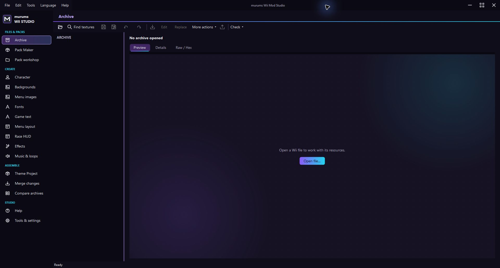

<h1 align="left">&nbsp; murums Wii Mod Studio</h1>

Windows desktop editor for Wii modding and Mario Kart Wii custom packs.

**[Download for Windows](https://github.com/murums04/murums-Wii-Mod-Studio/releases)** · [Install](#install) · [Report a bug](https://github.com/murums04/murums-Wii-Mod-Studio/issues)

Current release: **2.1.1-beta1**. By murums, with AI assistance.

## Features

- **HUD, menus & fonts:** positions, sizes, colours, textures, font previews and symbols.
- **Archives & graphics:** resource editing, image/GIF import and BRLAN animations.
- **Characters:** 3D model import, joint assignment, poses, keyframes and replacement export.
- **Effects, audio & packs:** race effects, WAV loop previews, Retro Rewind packs, theme projects and mod merging.
- **Text & help:** game messages, Unicode checks and integrated guides.



## Install

1. Download and run **murums.Wii.Mod.Studio.exe** from [Releases](https://github.com/murums04/murums-Wii-Mod-Studio/releases).
2. Choose an empty installation folder and optional tools; only Wiimms tools are preselected.
3. Select **Install**, then **Launch program**.

Requires **64-bit Windows** and **.NET Framework 4.7.2 or newer** for the bundled model components. Game files are not included; optional tool downloads require internet.

Updates: **Help > Check for updates**. Uninstall: **Windows Installed Apps** or `Uninstall.exe`. Run the installer with `--setup` to reopen setup.

<details>
<summary>Build from source</summary>

Requires Windows PowerShell and the .NET Framework C# compiler. Prepare the [model dependencies](internal/model/README.md) first; third-party binaries are excluded from this repository.

From the repository root:

```powershell
.\internal\build.ps1
.\internal\build-setup.ps1 -OutputPath "$PWD\dist\murums.Wii.Mod.Studio.exe"
```

Editor output: `internal/build`; installer output: `dist`. Game assets are not required for building.

</details>

## Feedback & license

- **Bug reports:** version, reproduction steps and affected format; no commercial game archives, credentials or private files.
- **License:** [PolyForm Noncommercial 1.0.0](LICENSE); source-available, not OSI-approved open source. Commercial use is not granted; earlier MIT grants remain valid.
- **Credits:** [third-party licenses and references](THIRD_PARTY.md) and **Help > About > Credits & licenses**; external tools retain their own licenses.
- Copyright (c) 2026 murums04.
